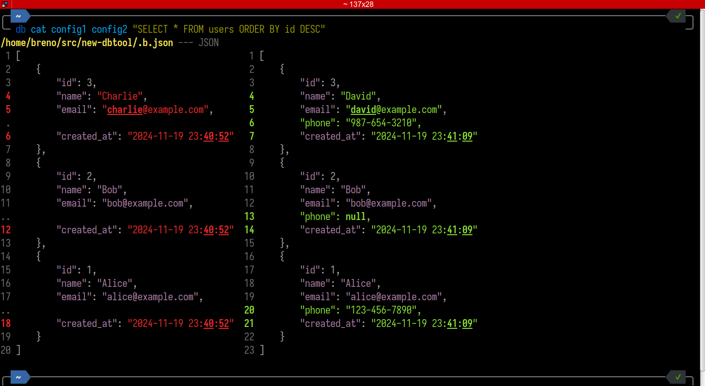
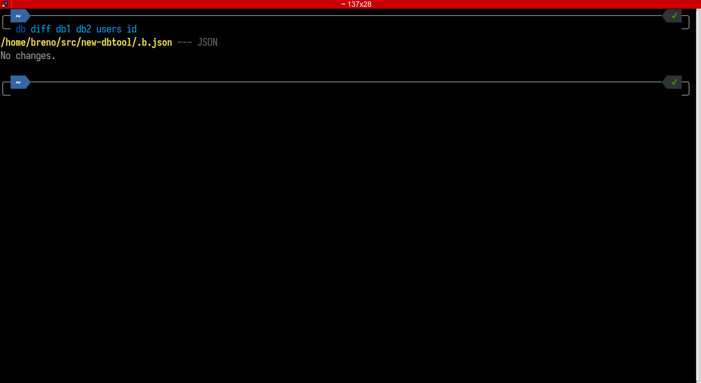

# DBTool

DBTool is a command-line tool for interacting with MySQL databases. It provides
a simple interface to perform various operations on databases, such as:

- Listing tables and their fields
- Comparing data and table schemas
- Copying tables between databases
- Displaying table data

## Installation

1. **Difftastic:** DBTool uses Difftastic for comparison. Install it by
following the instructions at
[Difftastic Manual](https://difftastic.wilfred.me.uk/installation.html).
2. `git clone https://github.com/br-lemes/dbtool.git`
3. `cd dbtool`
4. `composer install`

## Configuration

DBTool uses configuration files to store database credentials. Create a
configuration file in `config/` following this example:

```php
return [
    'host' => 'localhost',
    'database' => 'database_name',
    'username' => 'username',
    'password' => 'password',
];
```

## Usage

DBTool offers the following commands:

### Display or compare data from a table

**The output of this command will be in JSON format.**

Usage: `db cat <config1> [<config2>] <table|query>`

- `<config1>`: Configuration file of the first database.
- `<config2>`: Configuration file of the second database (optional).
- `<table|query>`: Table to display or compare data, or a SQL query.

**Examples:**

Display data from the `users` table of the database configured in
`example1.php`:

`db cat example1.php users`


Compare data from the `orders` table between the databases configured in
`example1.php` and `example2.php`:

`db cat example1.php example2.php orders`


Display the results of the query `SELECT * FROM products WHERE price > 100`
from the database configured in `example1.php`:

`db cat example1.php 'SELECT * FROM products WHERE price > 100'`


Compare the results of the query `SELECT * FROM products WHERE price > 100`
between the databases configured in `example1.php` and `example2.php`:

`db cat example1.php example2.php 'SELECT * FROM products WHERE price > 100'`


### Copy table from one database to another

Usage: `db cp <source_config> <destination_config> <table>`

- `<source_config>`: Configuration file of the source database.
- `<destination_config>`: Configuration file of the destination database.
- `<table>`: Name of the table to be copied.

**Examples:**

Copy the `users` table from the database configured in `example1.php` to the
database configured in `example2.php`:

`db cp example1.php example2.php users`

### Compare two databases or table schemas

**The output of this command will be in JSON format.**

Usage: `db diff <config1> <config2> [table] [field]`

- `<config1>`: Configuration file of the first database.
- `<config2>`: Configuration file of the second database.
- `[table]`: Table to compare the schema (optional).
- `[field]`: Field to compare (optional, requires table).

**Examples:**

Compare the databases (list of tables) configured in `example1.php` and
`example2.php`:

`db diff example1.php example2.php`


Compare the schema of the `products` table between the databases configured in
`example1.php` and `example2.php`:

`db diff example1.php example2.php products`


Compare the `name` field of the `users` table between the databases configured
in `example1.php` and `example2.php`:

`db diff example1.php example2.php users name`


### List tables of a database or fields of a table

**The output of this command will be in simple format, one name per line.**

Usage: `db ls <config> [table] [field]`

- `<config>`: Configuration file with database credentials.
- `[table]`: Table to show the schema (optional).
- `[field]`: Field to show (optional, requires table).

**Examples:**

List all tables in the database configured in `example1.php`:

`db ls example1.php`


List the fields of the `users` table of the database configured in `example1.php`:

`db ls example1.php users`


### List tables or table schema in JSON

**The output of this command will be in JSON format.**

Usage: `db ll <config> [table] [field]`

- `<config>`: Configuration file with database credentials.
- `[table]`: Table to show the schema (optional).
- `[field]`: Field to show (optional, requires table).

**Examples:**

List all tables in the database configured in `example1.php`:

`db ll example1.php`


List the schema of the 'users' table of the database configured in `example1.php`:

`db ll example1.php users`


Show details of the `email` field from the `users` table of the database
configured in `example1.php`:

`db ll example1.php users email`


## Autocomplete (Fish Shell)

To enable autocompletion of DBTool commands and options in Fish Shell, add the
file `completions/db.fish` to your autocomplete path.

## Contribution

Contributions are welcome! Feel free to open issues and pull requests.

## License

This project is licensed under the BSD Zero Clause License.
