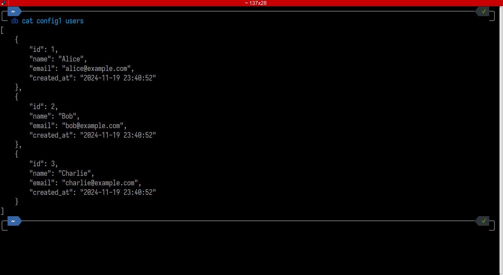

# DBTool

A command-line utility for managing and comparing MySQL and PostgreSQL
databases. DBTool helps you inspect, compare, copy, move and remove database
structures and data across different environments.

## Features

- List database tables and schema information
- Display and compare table contents
- Copy tables between databases
- Move or rename tables within or across databases
- Compare database schemas and structures
- Remove tables from a database
- Truncate all data from a table
- SQL query execution support
- Auto-completion for commands and arguments

## Installation

1. Clone the repository
2. Run `composer install`
3. Create configuration files in the `config` directory
4. DBTool uses Difftastic for comparison. Follow the instructions at
   [Difftastic Manual](https://difftastic.wilfred.me.uk/installation.html)

### Configuration Files

Create PHP files in the `config` directory with database credentials:

```php
return [
    'host' => 'localhost',
    'database' => 'database_name',
    'username' => 'username',
    'password' => 'password',
];
```

## Commands

### List Command (ls)

List database structures at different levels.

```bash
# List all tables in a database
db ls config1
```


```bash
# Show schema for specific table
db ls config1 users
```


```bash
# Show details for specific field
db ls config1 users email
```


Notes:

- Output is in JSON format for easy parsing
- Shows complete schema information including indexes
- Field details include type, length, nullable and default values

### Cat Command (cat)

Displays table contents or compares data between databases.

```bash
# Display table contents
db cat config1 users
```



```bash
# Execute SQL query
db cat config1 "SELECT * FROM users WHERE id = 1"
```


```bash
# Compare users table data between databases
db cat config1 config2 users
```


```bash
# Compare query results between databases
db cat config1 config2 "SELECT * FROM users ORDER BY id DESC"
```


Notes:

- When comparing tables, uses difft to highlight differences
- SQL queries must be quoted when using spaces or special characters
- Table names can only contain letters, numbers and underscore

### Copy Command (cp)

Copies a table's data and schema (same-type databases) to another database.

```bash
# Copy users table with all data from source to destination
db cp source_config dest_config users

# Copy products table between environments
db cp prod-db stage-db products
```

Notes:

- For same database types (e.g., MySQL to MySQL):
  - Prompts for confirmation if table exists in destination
  - Drops and recreates table with source schema and copies all data
- For different database types (e.g., MySQL to PostgreSQL):
  - Requires identical column names in destination table
  - Verifies only column names, not column types
  - Prompts for confirmation to clear existing data, but copy may fail if types
    are incompatible
  - Truncates existing data and copies data without altering table schema
- Always transfers all data from source to destination

### Move Command (mv)

Moves or renames a table within or across databases.

```bash
# Rename old_table to new_table in the same database
db mv config1 old_table new_table
# Move table from source to destination database
db mv config1 config2 table
```

Notes:

- Within same database:
  - Prompts for confirmation if destination table exists
  - Renames table, preserving schema and data
- Across databases (same type, e.g., MySQL to MySQL):
  - Prompts for confirmation if destination table exists
  - Copies schema and data, then drops source table
- Across databases (different types, e.g., MySQL to PostgreSQL):
  - Requires identical column names in destination table
  - Verifies only column names, not column types
  - Prompts for confirmation to clear existing data, but copy may fail if types
    are incompatible
  - Copies data without altering destination schema, then drops source table
- Always transfers all data from source to destination

### Diff Command (diff)

Compare database structures at different levels.

```bash
# Compare tables list between databases
db diff db1 db2
# Shows: '==' same, '!=' & '<>' different schema
# Shows: '>' only in db1 and '<' only in db2
```


```bash
# Compare users table schema in detail
db diff db1 db2 users
```


```bash
# Compare just the id field definition
db diff db1 db2 users id
```


Notes:

- Uses difft for colored output showing differences
- Can compare entire databases, single tables, or specific fields
- Useful for checking schema consistency across environments
- Use `--ignore-length=yes` to ignore `CHARACTER_MAXIMUM_LENGTH` for TEXT
  fields, enabled by default when comparing different database types (e.g.,
  MySQL to PostgreSQL)
- Use `--ignore-length=no` to include `CHARACTER_MAXIMUM_LENGTH` in comparisons

### Remove Command (rm)

Removes a table from a database.

```bash
# Remove users table
db rm config1 users
# Remove products table
db rm config1 products
```

Notes:

- Prompts for confirmation if table exists
- Permanently deletes the table and all its data

### Remove All Command (rm-all)

Removes all tables from a database.

```bash
# Remove all tables from the database specified
db rm-all config1
```

Notes:

- Prompts for confirmation before removing tables
- Permanently deletes all tables and their data

### Status Command (status)

Show migration status

```bash
# Show migration status
db status config1
```

### Truncate Command (truncate)

Truncates all data from a table, keeping its schema intact.

```bash
# Clear all data from users table
db truncate config1 users
# Clear all data from products table
db truncate config1 products
```

Notes:

- Prompts for confirmation if table exists
- Removes all data but preserves table structure and indexes

### Migrate Command (migrate)

Executes Phinx migrations on a database.

```bash
# Execute migrations on the config database
db migrate config
# Execute a specific migration
db migrate config migration_name
```

### Migration Command (migration)

Generates a Phinx migration file for a table.

```bash
# Generate migration for users table
db migration config1 users
```

Notes:

- Generates a Phinx migration file with timestamped filename
- Includes columns, timestamps, unique constraints, and indexes

### Rollback Command (rollback)

Rollback the last migration.

```bash
# Rollback the last migration
db rollback config1
```

### Run Command (run)

Execute an SQL file (including dumps restores) on a database.

```bash
# Execute script.sql on the config1 database
db run config1 script.sql
# Execute (restore) dump.sql
db run config1 dump.sql
```

Notes:

- Requires mysql for MySQL or psql for PostgreSQL to be installed
- The SQL file must be compatible with the target database

## Versioning

DBTool uses semantic versioning based on commit messages:

- `fix:` commits increment patch version (0.0.X)
- `feat:` commits increment minor version (0.X.0)
- Breaking changes (commits with `!:`) increment major version (X.0.0)

## Auto-completion Support

Command auto-completion is supported for:

- Configuration files
- Table names
- Field names

See `db completion --help` to see how to install and use.

## Requirements

- PHP 8.1 or higher
- Composer
- MySQL/MariaDB/PostgreSQL
- difft (for comparison features)

## Contributing

Contributions are welcome! Please feel free to submit a Pull Request.

## License

This project is licensed under the BSD Zero Clause License.
