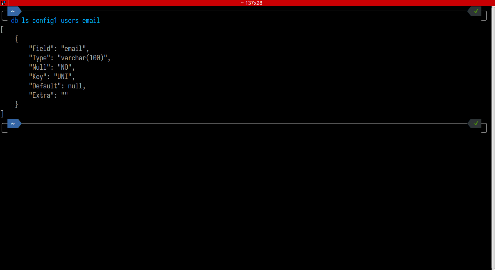
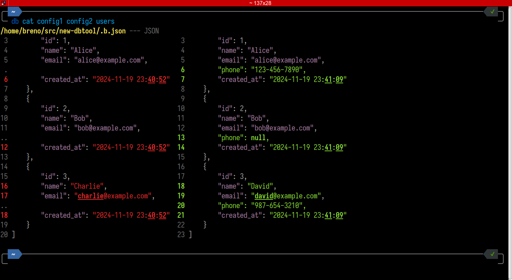

# DBTool

A command-line utility for managing and comparing MySQL databases. BTool helps
you inspect, compare and copy database structures and data across different
environments.

## Features

- List database tables and schema information
- Display and compare table contents
- Copy tables between databases
- Compare database schemas and structures
- SQL query execution support
- Auto-completion for commands and arguments

## Installation

1. Clone the repository
2. Run `composer install`
3. Create configuration files in the `config` directory
4. DBTool uses Difftastic for comparison. Follow the instructions at
   [Difftastic Manual](https://difftastic.wilfred.me.uk/installation.html)

### Configuration Files

Create PHP files in the `config` directory with database credentials:

```php
return [
    'host' => 'localhost',
    'database' => 'database_name',
    'username' => 'username',
    'password' => 'password',
];
```

## Commands

### List Command (ls)

List database structures at different levels.

```bash
# List all tables in a database
db ls config1
```


```bash
# Show schema for specific table
db ls config1 users
```


```bash
# Show details for specific field
db ls config1 users email
```



Notes:

- Output is in JSON format for easy parsing
- Shows complete schema information including indexes
- Field details include type, length, nullable and default values

### Cat Command (cat)

Displays table contents or compares data between databases.

```bash
# Display table contents
db cat config1 users
```


```bash
# Execute SQL query
db cat config1 "SELECT * FROM users WHERE id = 1"
```


```bash
# Compare users table data between databases
db cat config1 config2 users
```



```bash
# Compare query results between databases
db cat config1 config2 "SELECT * FROM users ORDER BY id DESC"
```


Notes:

- When comparing tables, uses difft to highlight differences
- SQL queries must be quoted when using spaces or special characters
- Table names can only contain letters, numbers and underscore

### Copy Command (cp)

Copies a table including its schema and data to another database.

```bash
# Copy users table with all data from source to destination
db cp source_config dest_config users

# Copy products table between environments
db cp prod-db stage-db products
```

Notes:

- Will prompt for confirmation if table exists in destination
- Copies both table structure (schema) and all data
- Source and destination can be different database types

### Diff Command (diff)

Compare database structures at different levels.

```bash
# Compare tables list between databases
db diff db1 db2
# Shows: '==' same, '!=' & '<>' different schema
# Shows: '>' only in db1 and '<' only in db2
```


```bash
# Compare users table schema in detail
db diff db1 db2 users
```


```bash
# Compare just the id field definition
db diff db1 db2 users id
```


Notes:

- Uses difft for colored output showing differences
- Can compare entire databases, single tables, or specific fields
- Useful for checking schema consistency across environments

## Versioning

DBTool uses semantic versioning based on commit messages:

- `fix:` commits increment patch version (0.0.X)
- `feat:` commits increment minor version (0.X.0)
- Breaking changes (commits with `!:`) increment major version (X.0.0)

## Auto-completion Support

Command auto-completion is supported for:

- Configuration files
- Table names
- Field names

See `db completion --help` to see how to install and use.

## Requirements

- PHP 8.2 or higher
- Composer
- MySQL/MariaDB
- difft (for comparison features)

## Contributing

Contributions are welcome! Please feel free to submit a Pull Request.

## License

This project is licensed under the BSD Zero Clause License.
